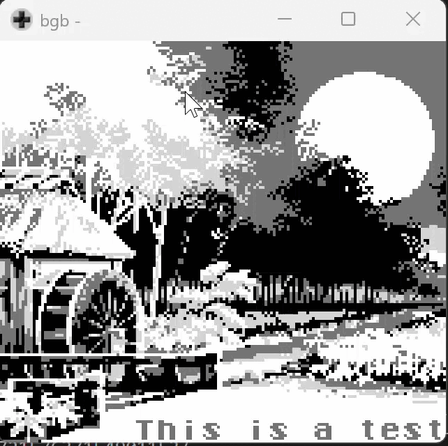

# Create Slide Shows as a Gameboy ROM

Images placed in the res/ folder will be automatically converted into C code and compiled into the viewer.

Slides can be defined as a json, referencing the images as background. Text can be overlayed with configurable colors and with or without a typewriter effect:

~~~json
{
        "background": "xt",
        "texts": [
            {
                "x": 7,
                "y": 4,
                "animated": true,
                "text": "Hello",
                "color": "white",
                "back": "black"
            },
            {
                "x": 7,
                "y": 5,
                "animated": true,
                "text": "World",
                "color": "white",
                "back": "black"
            }
        ]
    },
    {
        "background": "fesch",
        "texts": [ ]
    }
~~~
## Key Bindings
- A/Right: next text/slide
- B/Left: previous text/slide
- Start: go to first slide
- Select: toggle black screen

## Acknowledgements
Pixel art originally by RodrixAP under Creative Commons Attribution 2.0 Generic (CC BY 2.0)

https://www.flickr.com/photos/rodrixap/10591266994/in/album-72157637154901153/

## TODOs:
- sprites for typing effect?